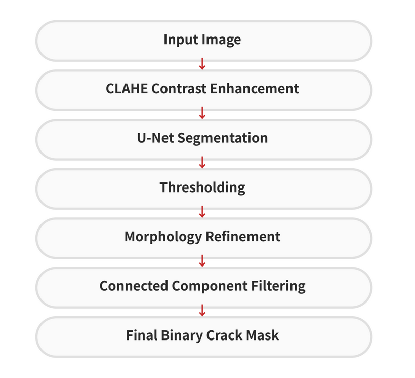
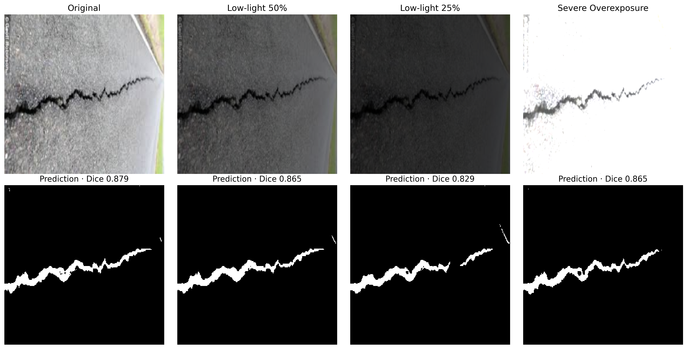
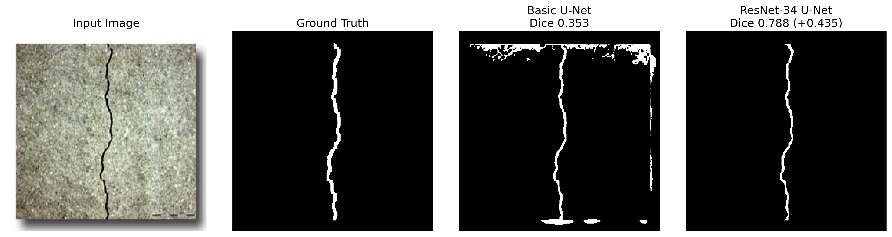
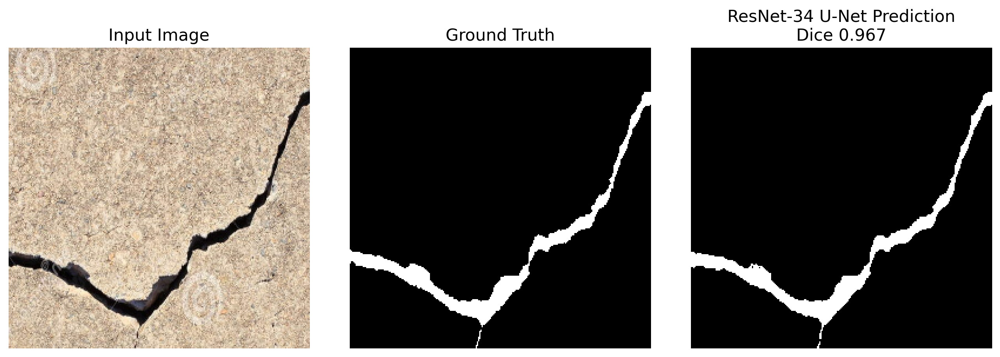
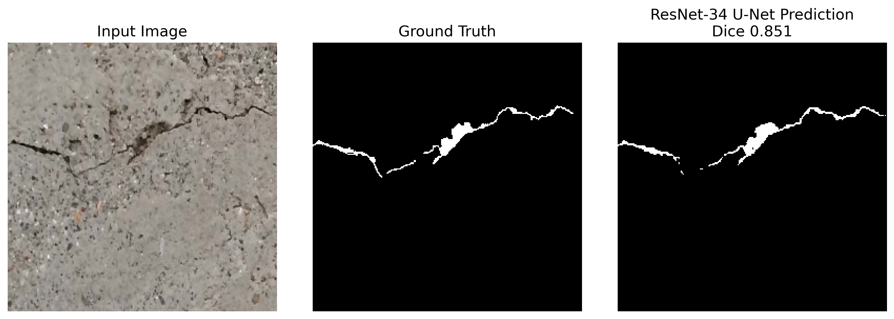

# Lighting-Robust Crack Segmentation with ResNet-34 U-Net and ONNX Runtime

## 1. Project Overview

This project develops a deep learning-based crack segmentation pipeline for detecting thin road and concrete surface cracks under varying lighting conditions.

The initial implementation focused on a basic U-Net with CLAHE preprocessing and morphology-based refinement. The project was later redesigned to improve model accuracy, lighting robustness, and evaluation reliability through:

- Train / Validation / Test separation
- BCE and Dice combined loss
- lighting-aware data augmentation
- ImageNet-pretrained ResNet-34 encoder
- freeze–unfreeze two-stage fine-tuning
- validation-based threshold selection
- morphology ablation experiments
- ONNX Runtime deployment evaluation

The final objective was to build a segmentation model that maintains stable crack detection performance not only on normal images, but also under low-light and overexposed conditions.

---

# 2. Problem Definition

Crack segmentation presents several challenges:

- crack regions are thin and occupy only a small portion of the image,
- low-light conditions reduce crack visibility,
- overexposure weakens surface texture and boundaries,
- background textures can be mistaken for cracks,
- and excessive post-processing can remove valid thin crack regions.

Therefore, this project focused on:

> improving crack segmentation accuracy while maintaining robustness under significant lighting changes.

---

# 3. Dataset

## DeepCrack Dataset

The project used the DeepCrack dataset, which provides surface images and corresponding binary crack masks.

Dataset structure:

```text
DeepCrack/
├── train_img
├── train_lab
├── test_img
└── test_lab
```

## Data Split

The original training set was divided into Train and Validation subsets using a fixed random seed.

| Split | Images | Purpose |
| --- | ---: | --- |
| Train | 240 | Model training |
| Validation | 60 | Model and threshold selection |
| Test | 237 | Final performance evaluation |

The Test set was not used during model selection or threshold tuning.

---

# 4. Final Pipeline

```text
Input RGB Image
→ Resize to 256 × 256
→ ResNet-34 U-Net Segmentation
→ Sigmoid Probability Map
→ Threshold 0.55
→ Binary Crack Mask
→ ONNX Runtime Inference
```



The final pipeline does not use CLAHE preprocessing or morphology post-processing.

Lighting variation is handled during model training through data augmentation instead of relying on fixed image preprocessing.

---

# 5. Baseline Model

## 5.1 Model Architecture

A basic U-Net was first used as the baseline semantic segmentation model.

### Input

- RGB image
- Resolution: 256 × 256

### Output

- Binary crack segmentation mask

### Baseline Training Setup

- Loss: BCEWithLogitsLoss
- Optimizer: Adam
- Batch Size: 4
- Validation split: fixed 240 / 60 split
- Best checkpoint selected using Validation Dice

## 5.2 Baseline Result

After reorganizing the evaluation process and training the baseline model with a separate Validation set, the model achieved:

| Model | Validation Dice | Validation IoU |
| --- | ---: | ---: |
| BCE Baseline | 0.7644 | 0.6434 |

This result was used as the reproducible baseline for subsequent loss-function, augmentation, and architecture experiments.

---

# 6. BCE and Dice Combined Loss

## 6.1 Motivation

Crack pixels occupy a relatively small area compared with background pixels.

Using BCE alone can emphasize pixel-wise classification but may not sufficiently optimize the overlap of thin crack structures.

To address this imbalance, the final training objective combined:

- BCE Loss for pixel-wise classification
- Dice Loss for foreground overlap optimization

## 6.2 Result

| Model | Validation Dice | Validation IoU |
| --- | ---: | ---: |
| BCE Baseline | 0.7644 | 0.6434 |
| BCE + Dice | 0.7871 | 0.6668 |

The combined loss improved both Dice and IoU while preserving thin crack structures more consistently.

---

# 7. Lighting-aware Data Augmentation

## 7.1 Motivation

The baseline model performed well on normal images but showed a significant performance decrease under severe lighting changes.

In particular, low-light images caused thin crack regions to disappear, while overexposure weakened surface contrast.

To improve robustness, the training data was explicitly organized into three lighting conditions:

| Training condition | Sampling ratio |
| --- | ---: |
| Original image | 40% |
| Low-light augmentation | 30% |
| Overexposure augmentation | 30% |

## 7.2 Applied Augmentations

### Low-light Augmentation

- brightness scaling
- gamma adjustment
- Gaussian noise

### Overexposure Augmentation

- contrast increase
- positive brightness shift

The augmentation was applied only to the Train subset. Validation and Test images remained unchanged during model and threshold selection.

---

# 8. Lighting Robustness Evaluation

Three models were compared on the same Validation subset using a fixed threshold of 0.50.

| Condition | BCE + Dice | Random Lighting | Balanced Lighting |
| --- | ---: | ---: | ---: |
| Original | 0.7862 | **0.7908** | 0.7804 |
| Low-light 50% | 0.6203 | 0.6928 | **0.7487** |
| Low-light 35% | 0.3707 | 0.4498 | **0.7193** |
| Low-light 25% | 0.2794 | 0.1972 | **0.6571** |
| Severe overexposure | 0.4736 | 0.6159 | **0.6985** |

Although the balanced lighting model showed a small decrease on original Validation images, it maintained significantly higher performance under low-light and overexposed conditions.

This demonstrated a trade-off between:

- maximum performance on normal images
- and stable performance across changing environments

The balanced lighting model was selected as the final model because robustness was considered more important for practical crack inspection.



---

# 9. ResNet-34 U-Net and Two-stage Fine-tuning

## 9.1 Motivation

The training set contained only 240 images, which limited the representation capability of a U-Net trained from random initialization.

To improve feature extraction with limited data, the baseline encoder was replaced with an ImageNet-pretrained ResNet-34 encoder.

The final model used:

- ResNet-34 encoder with pretrained ImageNet weights
- U-Net-style decoder with skip connections
- BCE and Dice combined loss
- balanced lighting augmentation
- two-stage freeze–unfreeze fine-tuning

## 9.2 Two-stage Training

### Stage 1: Frozen Encoder

The pretrained ResNet-34 encoder was frozen while the decoder was trained for 12 epochs.

| Stage | Best Validation Dice | Best Validation IoU |
| --- | ---: | ---: |
| Frozen Encoder | 0.8052 | 0.6835 |

### Stage 2: Full Fine-tuning

The encoder was then unfrozen and the complete network was fine-tuned for 30 epochs.

Different learning rates were assigned to the encoder and decoder:

- Encoder learning rate: 1e-5
- Decoder learning rate: 1e-4

The best checkpoint was obtained at epoch 24.

| Model | Validation Dice | Validation IoU |
| --- | ---: | ---: |
| Basic U-Net | 0.7816 | 0.6590 |
| ResNet-34 U-Net | **0.8259** | **0.7108** |

The pretrained encoder and two-stage fine-tuning improved Validation Dice by 0.0443 and IoU by 0.0518.

---

# 10. Threshold Selection

The final threshold was selected using only the Validation subset.

| Threshold | Dice | IoU |
| ---: | ---: | ---: |
| 0.30 | 0.8242 | 0.7084 |
| 0.40 | 0.8253 | 0.7101 |
| 0.50 | 0.8259 | 0.7108 |
| **0.55** | **0.8262** | **0.7112** |
| 0.60 | 0.8259 | 0.7108 |
| 0.70 | 0.8252 | 0.7099 |
| 0.80 | 0.8235 | 0.7076 |

The final threshold was fixed at:

```text
0.55
```

After threshold selection, no model or threshold settings were changed using the Test results.

---

# 11. Morphology Post-processing Experiment

## 10.1 Motivation

Morphology post-processing was tested during the basic U-Net development stage to determine whether small noise removal and crack reconnection could improve the prediction masks.

The following methods were compared on the Validation subset:

- no post-processing
- connected component filtering
- 3 × 3 morphology closing with connected component filtering

## 10.2 Result

| Method | Validation Dice | Validation IoU |
| --- | ---: | ---: |
| No post-processing | 0.7816 | 0.6590 |
| Remove small components, min area 20 | **0.7822** | 0.6598 |
| Closing + remove, min area 20 | 0.7820 | **0.6599** |

The maximum improvement was less than 0.001.

Because morphology processing could remove valid short or thin crack regions while providing only a minimal metric gain, it was excluded from both the basic U-Net and ResNet-34 U-Net final pipelines.

This experiment showed that:

> additional post-processing was not necessary once the model itself became sufficiently stable.

---

# 12. Final Test Evaluation

The final ResNet-34 U-Net and threshold 0.55 were evaluated on the untouched Test set.

## Official Test Result

| Model | Dice | IoU |
| --- | ---: | ---: |
| Basic U-Net | 0.7743 | 0.6625 |
| ResNet-34 U-Net | **0.7902** | **0.6749** |
| Improvement | **+0.0159** | **+0.0124** |

The final model improved both Dice and IoU on 237 unseen Test images.

The Validation Dice was 0.8262 and the Test Dice was 0.7902. Although the Test improvement was smaller than the Validation improvement, the architecture change still produced a measurable gain on unseen data.



---

# 13. Test-set Lighting Robustness

Lighting robustness was additionally evaluated on the Test set as a reference experiment.

The official Test score remains the result from the original, unmodified Test images.

| Test condition | Dice | IoU | Dice drop |
| --- | ---: | ---: | ---: |
| Original | **0.7902** | **0.6749** | 0.0000 |
| Low-light 50% | 0.7843 | 0.6657 | 0.0059 |
| Low-light 35% | 0.7843 | 0.6649 | 0.0059 |
| Low-light 25% | 0.7814 | 0.6606 | 0.0088 |
| Severe overexposure | 0.7469 | 0.6224 | 0.0434 |

Even when image brightness was reduced to 25%, Dice decreased by only 0.0088 from the original Test result.

The model also maintained Dice 0.7469 under severe overexposure.

---

# 14. ONNX Export and Runtime Evaluation

## 14.1 Motivation

The final model was exported to ONNX to verify:

- output consistency after model conversion
- CPU inference feasibility
- runtime performance improvement

## 14.2 Accuracy Preservation

The PyTorch and ONNX models were evaluated on the same 237 Test images.

| Runtime | Dice | IoU |
| --- | ---: | ---: |
| PyTorch CPU | 0.7902 | 0.6749 |
| ONNX Runtime CPU | 0.7902 | 0.6749 |

Additional output comparison:

| Metric | Result |
| --- | ---: |
| Dice difference | 0.00000044 |
| IoU difference | 0.00000063 |
| Maximum probability difference | 0.00005490 |

The ONNX model preserved the segmentation performance of the original PyTorch model.

## 14.3 CPU Inference Benchmark

Benchmark conditions:

- CPU inference
- Batch size: 1
- Input resolution: 256 × 256

| Runtime | Average latency | FPS |
| --- | ---: | ---: |
| PyTorch CPU | 72.59 ms | 13.78 |
| ONNX Runtime CPU | **41.46 ms** | **24.12** |

ONNX Runtime improved CPU inference speed by:

```text
1.75×
```

Although the current CPU speed is not sufficient for high-frame-rate real-time video processing, the experiment confirmed successful deployment conversion without accuracy loss.

---

# 15. Visualization Results

## Model Improvement Comparison

```text
Input Image
→ Ground Truth
→ Baseline Prediction
→ Final Prediction
```

The final ResNet-34 U-Net improved crack continuity and reduced missing regions compared with the basic U-Net.


## Lighting Robustness

Predictions were compared under:

- original lighting
- low-light 50%
- low-light 25%
- severe overexposure


## Representative Results

The project includes both a high-performing example and a typical prediction example.





---

# 16. Key Insights

1. A separate Validation subset was necessary for reliable model and threshold selection.
2. BCE and Dice combined loss improved thin crack overlap compared with BCE alone.
3. Balanced low-light and overexposure augmentation improved robustness under large lighting changes.
4. An ImageNet-pretrained ResNet-34 encoder improved feature extraction with only 240 training images.
5. Freeze–unfreeze two-stage fine-tuning improved Validation Dice from 0.7816 to 0.8262.
6. Morphology post-processing produced only marginal gains and was excluded from the final pipeline.
7. The final ResNet-34 U-Net achieved Dice 0.7902 and IoU 0.6749 on 237 Test images.
8. Low-light 25% Test Dice remained at 0.7814, only 0.0088 below the original Test score.
9. ONNX Runtime preserved segmentation accuracy while improving CPU inference speed by 1.75×.

---

# 17. Tech Stack

## Deep Learning

- Python
- PyTorch
- U-Net
- ResNet-34
- Transfer Learning
- BCE Loss
- Dice Loss

## Computer Vision

- OpenCV
- NumPy
- Lighting augmentation
- Connected component analysis
- Morphology ablation

## Deployment and Evaluation

- ONNX
- ONNX Runtime
- Matplotlib
- CSV / JSON result export

---

# 18. Conclusion

This project improved an initial U-Net crack segmentation model by redesigning both the training process and evaluation methodology.

The final ResNet-34 U-Net pipeline achieved:

- Validation Dice 0.8262 and IoU 0.7112
- Test Dice 0.7902 and IoU 0.6749 on 237 images
- Test Dice 0.7814 under low-light 25%
- Test Dice 0.7469 under severe overexposure
- identical PyTorch and ONNX segmentation accuracy
- CPU inference speed improvement from 72.59 ms to 41.46 ms
- 1.75× faster CPU inference with ONNX Runtime

The main result of the project was not simply adding preprocessing or post-processing operations, but improving the model itself through:

> reliable validation, loss-function redesign, lighting-aware augmentation, pretrained feature extraction, two-stage fine-tuning, and deployment-oriented evaluation.
