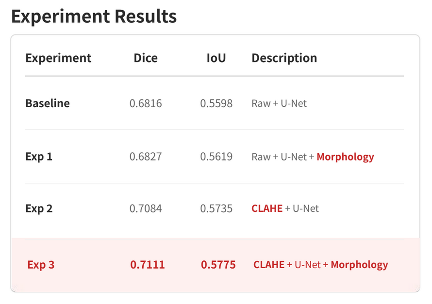
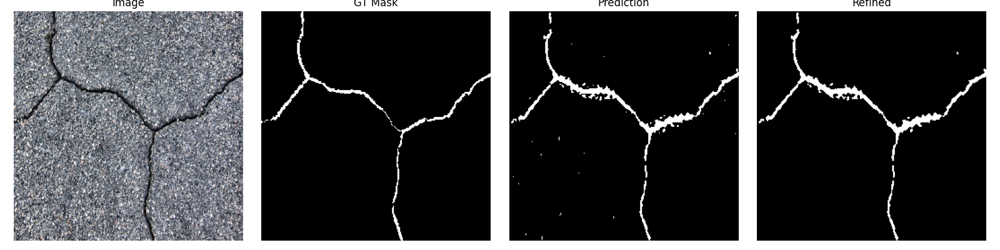
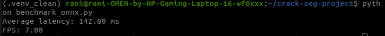
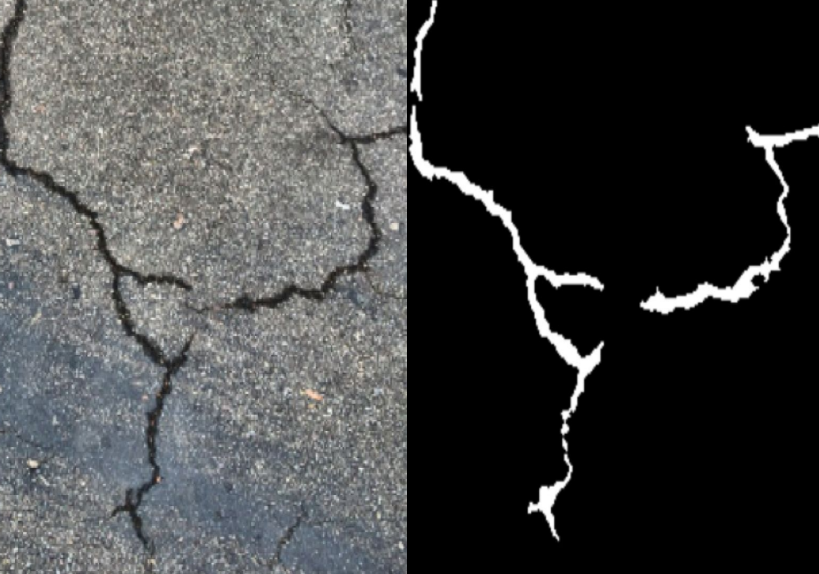

# Morphology-aware Crack Segmentation and Structural Analysis Pipeline

## 1. Project Overview

This project focuses on building a deep learning-based crack segmentation and structural analysis pipeline using computer vision techniques.

Instead of performing only binary crack segmentation, the project additionally explores:

* preprocessing experiments,
* morphology-based refinement,
* structural feature extraction,
* and deployment-oriented inference optimization.

The primary goal was not only improving segmentation accuracy, but also analyzing how preprocessing and post-processing affect segmentation stability in real-world crack images.

---

# 2. Problem Definition

Real-world crack segmentation presents several challenges:

* thin crack structures are easily disconnected,
* low-contrast cracks are difficult to distinguish from the background,
* texture noise generates false positives,
* and aggressive post-processing can unintentionally remove valid crack regions.

Therefore, this project focused on:

> improving structural stability of crack segmentation outputs while analyzing preprocessing and refinement trade-offs.

---

# 3. Dataset

## DeepCrack Dataset

The project was trained and evaluated using the DeepCrack dataset.

Dataset structure:

```text
DeepCrack/
├── train_img
├── train_lab
├── test_img
└── test_lab
```

The dataset contains:

* crack surface images
* binary segmentation masks

for supervised crack segmentation training.

---

# 4. Pipeline

```text
Input Image
→ U-Net Segmentation
→ Morphology Refinement
→ Feature Extraction
→ JSON Output
→ ONNX Runtime Benchmark
```

---

# 5. Baseline Segmentation

## 5.1 Model Architecture

A U-Net based segmentation architecture was implemented as the baseline model.

### Input

* RGB image
* Resolution: 256 × 256

### Output

* Binary crack segmentation mask

### Training Setup

* Loss: BCEWithLogitsLoss
* Optimizer: Adam
* Batch Size: 4
* Epochs: 5

---

## 5.2 Baseline Observation

The baseline segmentation model successfully learned:

* crack continuity,
* branch-like structures,
* and thin crack patterns.

However, several issues were observed:

* disconnected crack regions,
* isolated noise blobs,
* and unstable low-contrast crack segmentation.

To improve segmentation stability, morphology refinement was introduced.

---

# 6. Morphology-based Refinement

## 6.1 Motivation

Morphology refinement was applied to improve:

* crack continuity,
* structural consistency,
* and segmentation stability.

The main objectives were:

* reconnecting broken crack regions,
* removing isolated noise,
* and stabilizing segmentation outputs.

---

## 6.2 Applied Operations

### Morphology Closing

Applied to reconnect disconnected crack structures.

### Connected Component Filtering

Applied to remove small isolated noise regions.

---

## 6.3 Morphology Tuning

Different connected component thresholds were tested.

| Method                   | Dice   | IoU    |
| ------------------------ | ------ | ------ |
| Raw + U-Net              | 0.6816 | 0.5598 |
| Raw + U-Net + Morphology | 0.6827 | 0.5619 |



### Key Observation

Morphology refinement slightly improved segmentation stability and reduced small noise regions.

However, aggressive threshold settings also removed thin crack structures and reduced recall.

This experiment demonstrated a:

> precision-recall trade-off introduced by morphology refinement.

---

# 7. CLAHE Preprocessing Experiment

## 7.1 Motivation

CLAHE preprocessing was tested to improve low-contrast crack visibility.

Hypothesis:

> local contrast enhancement could improve crack segmentation performance.

---

## 7.2 Quantitative Results

| Method                     | Dice   | IoU    |
| -------------------------- | ------ | ------ |
| CLAHE + U-Net              | 0.7084 | 0.5735 |
| CLAHE + U-Net + Morphology | 0.7111 | 0.5775 |

CLAHE preprocessing improved:

* local crack contrast,
* edge visibility,
* and overall segmentation metrics.

Additional morphology refinement further improved:

* small noise reduction,
* and segmentation consistency.

---

## 7.3 Trade-off Analysis



Although CLAHE improved average segmentation performance, several trade-offs were observed:

* asphalt texture amplification,
* background grain enhancement,
* and thin crack fragmentation in some samples.

This experiment showed that:

> stronger contrast enhancement does not always guarantee stable segmentation outputs.

The project therefore analyzed both:

* quantitative metric improvements,
* and qualitative structural stability changes.

---

# 8. Feature Extraction

The project extended segmentation outputs beyond binary masks by extracting structural crack information.

## Extracted Features

### Crack Area Ratio

Ratio of crack pixels relative to the entire image.

### Connected Component Count

Number of connected crack structures.

### Total Crack Length Proxy

Estimated crack length based on crack pixel accumulation.

---

## Example JSON Output

```json
{
  "crack_area_ratio": 0.0213,
  "component_count": 4,
  "total_crack_length_px_proxy": 1392.0
}
```

This stage expanded the project from:

```text
simple segmentation
```

into:

```text
structural crack analysis
```

---

# 9. ONNX Export and Inference Benchmark

## 9.1 Motivation

The project additionally explored deployment-oriented inference optimization using ONNX Runtime.

The trained model was exported to ONNX format and benchmarked for inference latency.

---

## 9.2 Benchmark Environment

* ONNX Runtime
* CPU Inference
* Input Size: 256 × 256

---

## 9.3 Benchmark Results

| Metric          | Result    |
| --------------- | --------- |
| Average Latency | 142.80 ms |
| FPS             | 7.00      |



Segmentation-based inference required significantly higher computation compared to standard object detection pipelines.

The benchmark confirmed:

* successful ONNX export,
* deployment feasibility,
* and runtime inference analysis.

---

# 10. Visualization Analysis

## Raw Baseline Segmentation

Observed characteristics:

* stable crack continuity,
* branch structure preservation,
* and thin crack segmentation capability.

---

## Morphology Refinement

Observed effects:

* small noise reduction,
* improved segmentation consistency,
* but occasional thin crack removal.

---

## CLAHE Experiment

Observed effects:

* improved crack visibility,
* stronger edge contrast,
* but increased texture amplification and occasional segmentation fragmentation.

---

# 11. Key Insights

1. CLAHE preprocessing improved overall segmentation performance.
2. Morphology refinement stabilized segmentation outputs when carefully tuned.
3. Aggressive refinement reduced thin crack recall.
4. Preprocessing and post-processing tuning significantly affected segmentation stability.
5. Pipeline refinement sometimes had greater impact than changing model architecture.

---

# 12. Tech Stack

## Deep Learning

* PyTorch
* U-Net
* ONNX Runtime

## Computer Vision

* OpenCV
* CLAHE
* Morphology Operations
* Connected Component Analysis

## Utilities

* NumPy
* Matplotlib
* JSON Export

---

# 13. Future Work

Potential future improvements include:

* skeletonization-based crack length estimation,
* crack width estimation,
* lightweight segmentation backbones,
* GPU inference benchmarking,
* quantization optimization,
* and deployment optimization.

---

## Final Segmentation Result



# 14. Conclusion

This project implemented a complete crack segmentation and structural analysis pipeline including:

* deep learning-based segmentation,
* preprocessing analysis,
* morphology refinement,
* structural feature extraction,
* and ONNX deployment optimization.

The project demonstrated that:

> preprocessing and post-processing refinement can significantly affect segmentation structural stability, sometimes more than changing the model architecture itself.
